### Hi there, I'm Wescley Júnior! 👋

	

---

### 🚀 About Me

* 🎓 **Education:** Currently focused on Computer Engineering fundamentals at CEFET-MG.
* 💻 **Focus:** Developing efficient solutions and continuously learning new languages.

---

### 💻 Tech Stack & Tools

**Languages**

	
	
	
	
	
	

**Frontend & Design**

	
	
	
	

**Backend & CMS**

	
	
	

**Tools & Environment**

	
	
	
	
	

---

### 🏗️ Concepts & Methodologies

	
	

---

### 📊 GitHub Stats

	<picture>
		
	</picture>

	<picture>
		<source srcset="https://github-readme-activity-graph.vercel.app/graph?username=wescleyj&bg_color=000000&color=ffffff&line=ffffff&point=ffffff&area=true&hide_border=false&border_color=ffffff" media="(prefers-color-scheme: dark)" />
		<source srcset="https://github-readme-activity-graph.vercel.app/graph?username=wescleyj&area=true&hide_border=false" media="(prefers-color-scheme: light), (prefers-color-scheme: no-preference)" />
		
	</picture>

	<picture>
		
	</picture>

---

<h3 align="center">🏆 Achievements & Visits</h3>

	<a href="https://github.com/ryo-ma/github-profile-trophy">
		<picture>
			<source srcset="https://gh-trophy.cdnsoft.net/?username=wescleyj&theme=onedark&no-bg=true&column=7&margin-w=15&margin-h=15" media="(prefers-color-scheme: dark)" />
			<source srcset="https://gh-trophy.cdnsoft.net/?username=wescleyj&no-bg=true&column=7&margin-w=15&margin-h=15" media="(prefers-color-scheme: light), (prefers-color-scheme: no-preference)" />
			
		</picture>
	</a>

### 📫 Get in Touch

	
	

